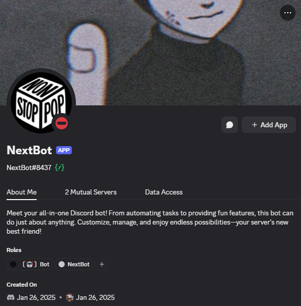

<div align="center">
  <h1>NextBot</h1>
  <p><strong>All-in-One Discord Bot by ZeroByte</strong></p>
  
  
</div>

---

## 🚀 Overview

**NextBot** is a powerful, all-in-one Discord bot developed by **ZeroByte**, designed to enhance your server with moderation, automation, entertainment, and utility tools — all in one package.

---

```bash
# NOTE: bot is still in beta status 
# and wont be published until its fully done
```

---

## 🛠 Features

- 🎮 **Games & Fun** – Interactive commands to keep your community entertained.
- 🔧 **Moderation Tools** – Kick, ban, mute, warn, and more.
- 📈 **Logging System** – Tracks member actions and server events.
- ⚙️ **Custom Commands** – Create your own server-specific commands.
- 🎉 **Giveaways** – Run and manage timed giveaways.
- 💡 **Utility Commands** – User info, server stats, uptime, and more.
- 📌 **Message Management** – Clear, pin, and manage messages with ease.
- 🌐 **Multi-language Support** *(Coming Soon)*

---



